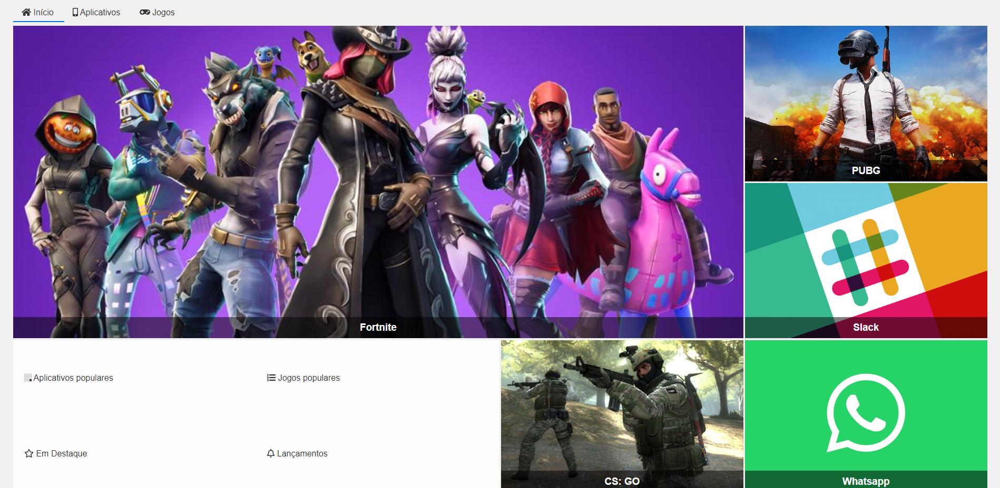

# Alura Store

>Alura | Cursos online de Tecnologia

>Formação em Front-END

Projeto construído no curso CSS Grid: simplificando layouts.

🔗[Clique aqui para acessar](https://matheus-liber.github.io/alura-store/)

## 🛠 Tecnologias

- HTML
- CSS
- Git e Github

## 💬 Explicação

Este projeto foi desenvolvido no curso CSS Grid: simplificando layouts, e teve por objetivo exercitar o uso da ferramenta Grid do CSS assim como o conceito de *_responsividade_*, adaptando o layout criado em resolução de desktop para resoluções menores, de tablet e celular

## 📩 Contato

LinkedIn: https://www.linkedin.com/in/matheus-silva-37b255123/

Email: matheuslibergt@gmail.com

Telefone: (84) 9 9817-8553